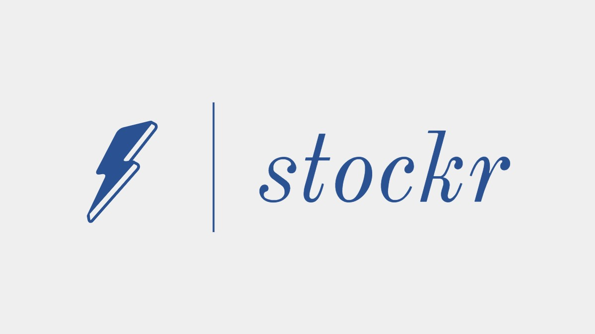
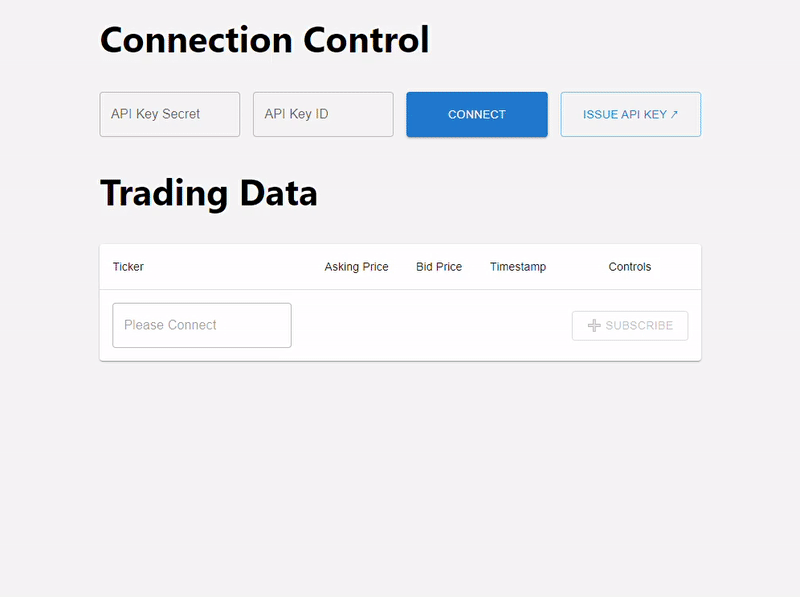

# Welcome to stockr

_stockr_ is a small web app for monitoring real-time trading data, Powered by
WebSockets

Play with it live at [stockr.soofgolan.com](https://stockr.soofgolan.com)

## Get Started

You'll need an API key from [Alpaca HQ](https://alpaca.markets/)

Credentials are stored locally on your browser and sent directly to Alpaca
during the handshake.
